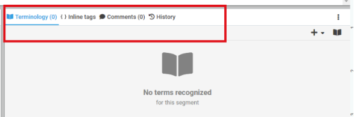

### Tested Page
https://xtm.cloud

### Additional info:
I used Visual Studio Code for Task 1 
and IntelliJ IDEA for Task 2&3 (with Git)   
I decided not to use branches  
Unused code may be found (refactoring is needed).

###### TODO:
-add assertions  
-add adnotation/tags e.g. @Test

# Task 1

* Description of the History tab into a new project

  The history Tab location: Log into account (I used trial account) > Projects Tab > Add project > from context menu select '“Open XTM Workbench'.  
  
  
  
 

>The "History" tab is a feature that allows users to track and manage their previous activity or interactions within the application.
>  This tab:   
*Records past interactions: It stores a log of user actions,  when specific items were edited.  
*Provides timestamps: The timestamps associated with each entry indicate the exact time of the interaction.  
*Enables backup and restoring: It makes backup of the text and Users may be able to restore segments in the history based on date.  
*Offers a chronological view: The history is displayed in a chronological order, with the most recent actions appearing at the top.  
 Overall, the "History" tab serves as a useful tool for users to review their past activities, identify trends, and potentially troubleshoot any issues or inconsistencies.
 

* Example test scenario with steps
 
>The file *xlx is attached in the folder TASK 1  (can be opened via MS Excel) *In case of an opening error, use the download button in the file folder (via Raw file content)
.

# Task 2&3
How does the test work?  

Task 2: 
1. Opened the testing page
2. Opened XTM Cloud feature
3. Calculate the price for Group - 2 to 4 users, 3 users, 12 months, 30,000 words
4. Checking if the total cost is equal to $831.60.

Task 3:
1. Opened the testing page
2. Opened documentation from resources
3. Choosing a Cloud help page
4. Opened Documentation version 13.7
5. Clicked for additional info
6. Choosing from the menu on the left Stop words section
7. Download text file sk - Slovak
8. Checking if the file is successfully downloaded
  
>### SETUP 

Tested on:   
-Windows 11 Pro x64   
-Chrome Browser  128.0.6613.85 64-bit    
-ChromeDriver win64 Stable 128.0.6613.84  r1331488	   
-Java JDK 22   
-Selenium 4.23.1
 

>Please run Test1 java file to run the Test from Task 2   
>Please run Test2 java file to run the Test from Task 3
